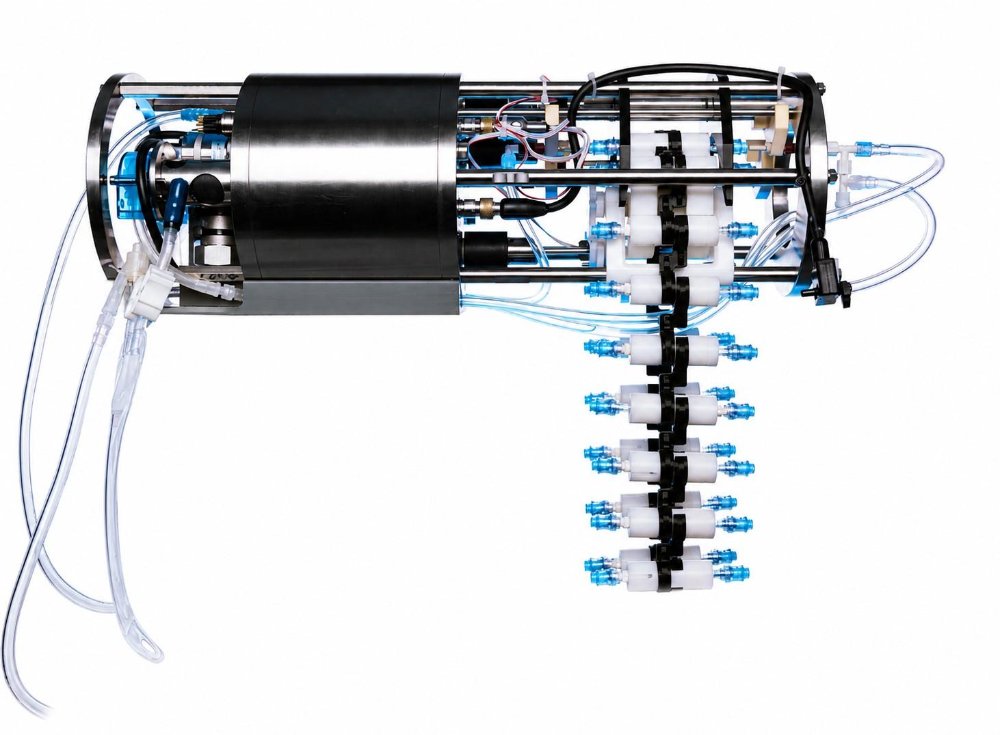
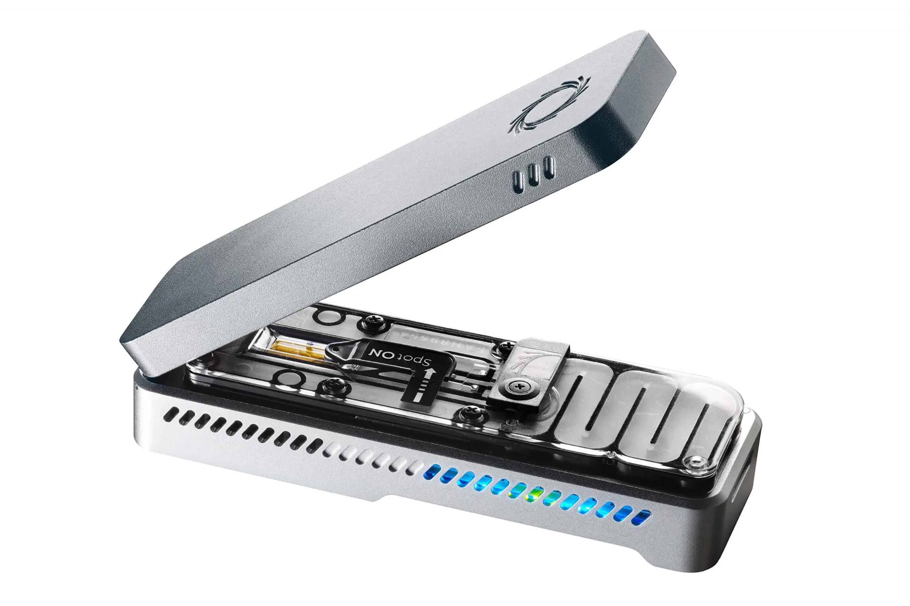

# 🧭 Introduction

This project evaluates the use of Oxford Nanopore Technologies (ONT) sequencing combined with a Tree of Life metabarcoding approach for broad-scale marine biodiversity assessment. Environmental DNA (eDNA) samples were collected using the **RoCSI autonomous sampling system** and subsequently analysed using the **portable MinION sequencing platform**, providing a workflow that combines autonomous marine sampling with rapid, portable molecular analysis.

<div style="display:flex; justify-content:center; gap:3rem; align-items:flex-start; margin:1.5rem auto;">

<div style="width:35%; text-align:center;">  <p style="font-size:0.9em; margin-top:0.4rem;">The NOC’s Robotic Cartridge Sampling Instrument (RoCSI).</p> </div>

<div style="width:35%; text-align:center;">  <p style="font-size:0.9em; margin-top:0.4rem;">The Oxford Nanopore MinION sequencing device.</p> </div>

</div>

The study uses 33 seawater samples collected during the **BIO-Carbon II** cruise aboard the *RRS James Cook*, along a transect extending from northern Scotland to Cardiff and covering much of the west coast of Great Britain. The transect spans contrasting marine environments and substantial gradients in environmental conditions, including temperature, salinity and chlorophyll concentration, providing a valuable test bed for assessing the ability of ONT metabarcoding to characterise biodiversity across different marine habitats.

{fig-cap="Map of UK showing the chlorophyll concentrations and the location of the samples" width="100%"
fig-align="center"
}

By integrating portable nanopore sequencing with autonomous eDNA sampling, the project also contributes to the development of faster and more scalable approaches to marine biodiversity monitoring. Ultimately, such workflows could support the transition from conventional retrospective eDNA analysis towards near-real-time biodiversity observations at sea.

## Metadata plots

Before looking into the metabarcoding data, let's have a quick look at the metadata.

```{r, message=FALSE, warning=FALSE}
library(dplyr)
library(readxl)
library(tidyverse)
library(stringr)
library(tibble)
library(Biostrings)
library(ggOceanMaps)
library(ggspatial)

# Metadata → rownames = barcodeXX
meta <- read_xlsx("data/Metadata_JC269_UKWC.xlsx")

meta <- meta %>%
  mutate(
    Lon = as.numeric(Lon),
    Lat = as.numeric(Lat)
  )

```
